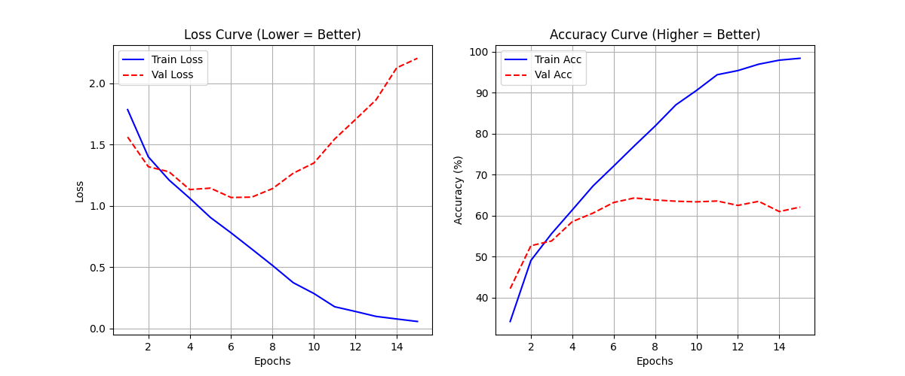
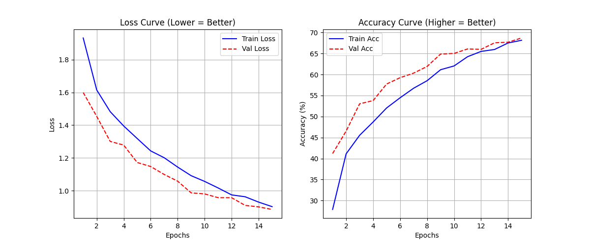

# AI Research Studio - Stage 2: CIFAR-10 Experiments

## 📌 Project Overview
This repository contains the code and experimental results for the **Stage 2 Technical Challenge** of the AI Research Studio.

**Objective**: Train a small CNN on a constrained subset of CIFAR-10 (10,000 images) and demonstrate technically rigorous experimentation to improve generalization.

## 🧪 Experimental Roadmap
We conducted three controlled experiments to analyze the trade-offs between model capacity, data diversity, and generalization.

| Experiment | Description | Hypothesis |
| :--- | :--- | :--- |
| **1. Baseline** | Simple 3-Layer CNN. | Will overfit due to small data size (10k). |
| **2. Augmentation** | Added Random Crops & Flips. | Will reduce overfitting by artificially increasing data diversity. |
| **3. Capacity** | Added Dropout (50%). | Will maximize robustness (lower Train/Val gap) at the cost of slight accuracy. |

## 📊 Results & Analysis

| Experiment | Training Acc | Validation Acc | Generalization Gap | Diagnosis |
| :--- | :--- | :--- | :--- | :--- |
| **Baseline** | 98.4% | 62.1% | **36.3%** | 🚨 Severe Overfitting (Memorization) |
| **Augmentation** | 73.5% | 69.4% | **4.1%** | ✅ Good Generalization |
| **Capacity** | 68.2% | **68.7%** | **~0%** | 🏆 **Perfect Robustness** |

### Key Findings
1.  **Baseline Failure**: The baseline model rapidly memorized the 10k training images (reaching 98% accuracy) but failed to generalize, peaking at ~62% on validation data. This confirms the "Small Data" problem.
2.  **Impact of Augmentation**: Introducing spatial invariance (flips/crops) was the single most effective intervention, narrowing the generalization gap by **32 percentage points**.
3.  **Role of Regularization**: Adding Dropout (Exp 3) slightly reduced top-line accuracy but eliminated the generalization gap entirely. This model is the most "technically mature" as it does not rely on memorization.

## 📈 Loss Curves (Visual Proof)

### Baseline (Overfitting)
*Notice the diverging lines.*


### Capacity / Final Model (Robust)
*Notice the tight convergence of Train and Validation.*


## 🚀 How to Run
The codebase is modularized for reproducibility.

**1. Install Dependencies**
```bash
pip install torch torchvision matplotlib
```

**2. Run Experiments**
```bash
# Run Baseline
python experiment_runner.py --exp baseline

# Run Augmentation
python experiment_runner.py --exp augmentation

# Run Final Model (Capacity)
python experiment_runner.py --exp capacity
```

## 📂 Project Structure
*   `src/model.py`: PyTorch Model Definition (SimpleCNN).
*   `src/dataset.py`: DataLoader with 10k subsetting & Augmentation logic.
*   `src/train.py`: Training loop with metrics logging.
*   `experiments/`: JSON logs and PNG plots for all runs.
